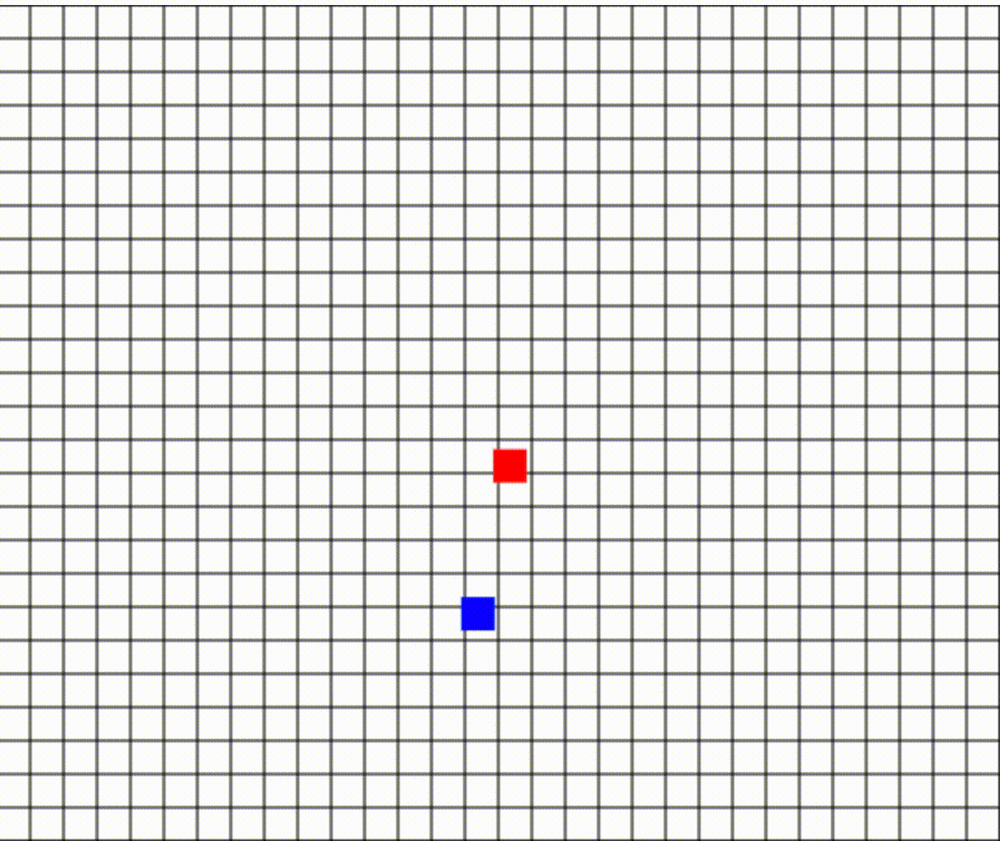
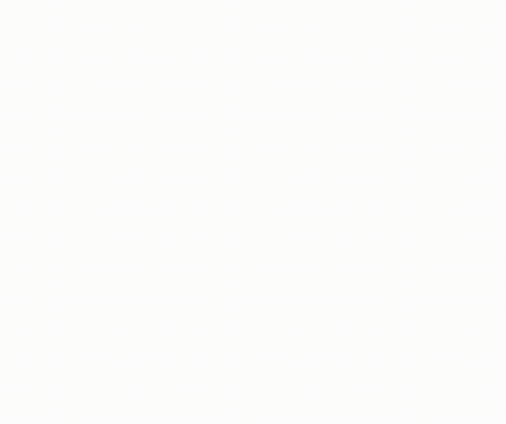

# Simulations for Stochastic Patrol Strategies

---

## Intelligent Agent Design - Objective 
> Suppose you are given a 6m x 5m target area to look for adversarial intruders. Write and implement an algorithm for a quadrotor UAV so that it can patrol the target area without revealing its strategy to intruders.
>
> *Constraint: Don’t use an area coverage planning strategy, it might be too easy to decode for intruders.*
--- 

## Motivation - Two Considerations

The motivation behind this project was to find a solution to the conflicting demands of unpredictable patrols and guaranteed coverage of the observable space. It is important to have a patrol scheme that is unpredictable to prevent pattern recognition and exploitation. At the same time, it is equally important to ensure that the entire domain space is surveyed.

On the one hand, deterministic methods fail to meet the requirement of unpredictability, while on the other hand, a purely stochastic approach does not guarantee that the entire space will be covered. This project aimed to bridge this gap by devising a non-predictable patrol strategy that still guarantees full coverage of the observable space. The end goal is to provide a solution that balances the two conflicting demands, ensuring both unpredictability and guaranteed coverage.

---
## Approach - Stochastic + Deterministic

The patrol approach employs a combination of random sampling and weighted path selection to ensure a complete survey of the patrol space. The random sampling method used is Roulette Wheel Selection, which guarantees that every area of the space is surveyed. The approach immediately repeats the survey when all cells have been visited in a completely different fashion, where no two cycles are similar.

The path to the waypoint takes into consideration weights that maximize the discovery of the unvisited spaces while also allowing the observer to revisit previously visited cells. The weights assigned to each cell are a combination of a penalty factor and a factor that accounts for the unvisited cells in the space. The penalty factor is applied to cells that have already been visited, while the unvisited cells factor encourages the observer to visit unvisited areas.

To allow for an even more comprehensive survey and optimize each pass, the observer's path to the waypoint is not restricted to a straight line. The paths are allowed to be curvy, which helps to reduce the likelihood of a patterned survey and ensures a more thorough exploration of the space. 

The combination of random sampling, weighted path selection, and curvy paths provides a flexible and efficient approach for patrolling a designated space.

---
## Algorithmic Overview - Methods

In this simulation, a quadcopter is tasked with patrolling a region in an unpredictable way. This approach divides the world into a grid of viewable cells which represents what the rotocopter can observe at any given time, however, the quadcopter is not limited to moving only along the grid. Its mobility allows it to make non-grid movements, creating an environment that operates in both a gridded and continuous coordinate systems.

The quadcopter sets out on its mission by moving towards random waypoints, determined by the select_random_waypoint function. The specifics of the simulation, such as world size, cell size, quadcopter speed, enemy count, and enemy speed, are all stored in a data dictionary. 

The grid is created by the init_grid function, which adds cells to the grid at specific positions (i,j) using the add_masking_cell function. The get_world_coordinates and get_grid_coordinates functions allow for easy conversion between world and grid coordinates. The remove_from_grid function can remove cells from the grid, while the move_to_waypoint function moves the quadcopter towards its next waypoint, taking into account its speed and step size. The check_waypoint_reached function determines if the quadcopter has reached its waypoint, and the unmask_cell_at_observer function removes the cell at the quadcopter's position.

To add excitement to the simulation, the init_enemies function adds a number of enemies, represented by red cubes, to the world. The move_to_random_adjacent_cell function moves each enemy to a randomly chosen adjacent cell. They actively avoid the cell the player is in.

The sysCall_thread function serves as the main thread of the simulation, initializing the floor, grid, and enemies, and then running an infinite loop that moves the quadcopter and enemies, removes cells from the grid, and checks for either the capture of an enemy or the reaching of a waypoint.

---

## API Documentation

📚 **[API - Python + CoppelliaSim](API.md)**

---

## CoppeliaSim Simulation for Stochastic Patrol Plan

---

## JavaScript Demo for Stochastic Patrol Plan

